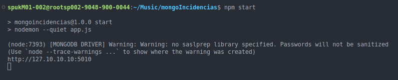
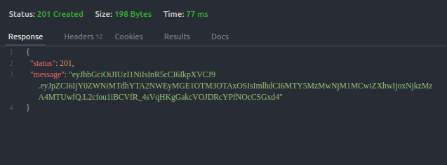
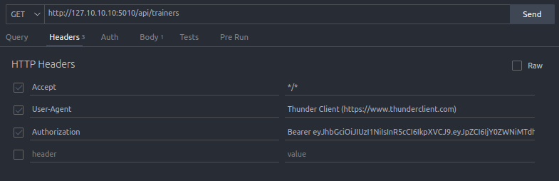
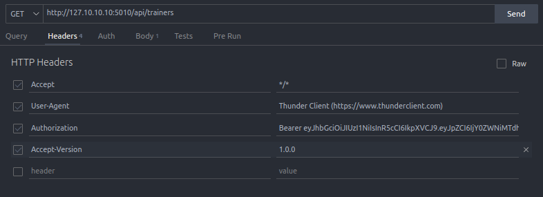

# MongoIncidencias


Para usar este proyecto despues de haberlo descargado lo primero que necesitas es asegurar que estas usando la version `18.16.1` de `nvm`, para eso por la terminal manda el siguiente comando.

```
nvm install 18.16.1
```

Ahora tienes que usar esa version con el siguiente comando.

```
nvm use 18.16.1
```


### Variables de entorno

Ahora tienes que colocar tus variables de entorno, tienes un ejemplo de como deben ser en el archivo `.env.exmple`, solo tienes que llenar los campos vacios con sus correspondientes datos y luego eliminar la parte `.example` del nombre del archivo dejando solo el `.env`.


Una vez hecho todo vamos a instalar las dependencias utilizadas con el comando

```
npm install
```

para confirmar que te quedo correcto vamos a arrancar el nodemon con el comando

```
npm start
```




### Tokens

Para poder utilizar los endpoints y hacer consultas primero necesitas tener un token de trainer para validar los permisos, hay cuatro trainers disponibles de los cuales solo con el 4 que es Jholver se puede crear, actualizar y eliminar trainers, con el resto solo se puede consultar que trainers existen con un get.
Para generar el token vas a usar el siguiente endpoint

```
http://127.10.10.10:5010/api/token
```

Y por el body tendras que mandar lo siguiente

```
{
  "id_trainer": 4
}
```

El valor a mandar tiene que ser un id de algun trainer ya existente, una vez hecho la respuesta deberia ser algo asi.



Ahora vas a copiar el token del `message` y lo vas a pegar en los headers habilitando el `Authorization`.

Tienes que colocar un `Bearer` antes de colocar el token, quedando de la siguiente forma




Ahora tienes que colocar la version que quieras utilizar, de las cuales tienes 2 opciones la `1.0.0` o la `3.5.0`.

Eso tambien se pone en los headers y activas la opcion `Accept-Version`, quedando de la siguiente forma.



Ahora si ya puedes realizar consultas.

### 

### Endpoinst

```
http://127.10.10.10:5010/api/trainers
http://127.10.10.10:5010/api/incidencias
```

Con esos 2 endpoints puedes solicitar, crear, actualizar y eliminar la informacion en la base de datos, solo necesitas cambiar el metodo que estas realizando, las opciones son `GET`,  `POST `,  `PUT` y  `DELETE`. 
